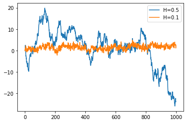

# fBm

fBm is a package for generating Fractional Brownian Motion (fBm).

## Example
Using the naive method to generate the fBm.
```python
from fbm.sim import naive
import matplotlib.pyplot as plt

size = 1000
fbm_gen = naive.NaiveFBmGenerator()
h05 = fbm_gen.generate_fBm(H=0.5, size=size)
h01 = fbm_gen.generate_fBm(H=0.1, size=size)

plt.plot(range(size), h05, label='H=0.5')
plt.plot(range(size), h01, label='H=0.1')
plt.legend()
plt.show()
```



More examples can be found in the `notebooks` folder.

## Package Structure
- `fbm`
  - The root package
- `fbm.sim`
  - The subpackage that includes all the simulation methods of fbm.
  - Methods at this moment:
    1. naive
    2. cholesky
    3. hosking
    4. davies_harte
   
- `fbm.testing`
  - The subpackgae that includes all the testing methods of the identification
    of the fbm.
  - Methods at this moment:
    1. Chisquare
   
- `fbm.utils`
  - The submodule that includes some common functions that will be used throughout
    the package